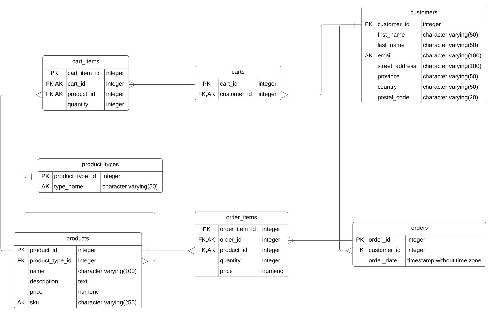

# Module 6

In this module, we will explore backend development using JavaScript and SQL, focusing on constructing the backend for a hypothetical online store. You'll work with a detailed SQL schema that forms the backbone of an e-commerce system. The file [online-store.md](./online-store.md) outlines the proposal for the online store and its schema, encompassing:

- Customers
- Product types
- Products
- Carts
- Cart items
- Orders
- Order items



Modules 6 and 7 will guide you in setting up a backend server framework using Node.js. You will:

- Practice using JavaScript for Test-Driven Development (TDD).
- Implement HTTP REST endpoints for customers and products.
- Develop backend logic to handle HTTP requests and persist data in the database.
- Learn to use both raw SQL and the Sequelize ORM for database interactions from JavaScript.
- Utilize an API test tool to execute HTTP REST requests.

---

### Next Steps in the Learning Journey

After solidifying the foundation in Modules 6 and 7, you will progress to implementing the shopping cart and order functionalities in the backend as part of a capstone project during Modules 8 and 9. This will include:

- Defining HTTP requests with JSON payloads for testing with a REST client.
- Developing HTTP REST endpoints for carts and cart items.
- Routing HTTP requests and managing data persistence in the backend.
- Integrating raw SQL and Sequelize ORM for database operations from JavaScript.

## Recommended Readings

- For an in-depth understanding of Sequelize, refer to the [Sequelize Documentation](https://sequelize.org/docs/v6/getting-started/).
- To learn more about REST, visit [What is REST](https://restfulapi.net).

---

### Learning Activities

1. **Initialize the Online Store Project**
   - Follow the setup instructions in [neon.md](neon.md) to prepare Neon for your development environment.
   - Ensure the `online-store` database is configured in your Neon setup.

2. **Configure Database Credentials**
   - Go to `src/config/config.env` in your project folder.
   - Update the environment variables with your Neon database credentials as follows:
     ```
     PGHOST='your-neon-host'
     PGUSER='your-username'
     PGPASSWORD='your-password'
     PGDATABASE='online-store'
     DATABASE_USE_SSL=true
     ```

### Database Schema and Data Management

3. **Prepare the SQL Schema**
   - Examine the SQL files in `src/sql` to familiarize yourself with the schema and initial data of the fictitious online store.
   - These files contain queries for table creation and customer data importation.

### Testing Database Operations

4. **Review and Execute Test Scripts**
   - In `package.json`, find the test scripts under the `scripts` section.
   - Execute the following commands to ensure successful operation:
     - `npm run test:drop-database` drops the existing database.
     - `npm run test:create-database` creates a new database.
     - `npm run test:import-customers` imports customer data.

5. **Inspect Data in Neon UI**
   - After test execution, use the Neon dashboard to inspect the `customers` table.
   - Verify the table's existence, record count, and data accuracy, ensuring that the tests have correctly interacted with the database.

6. **Implement and Debug Tests**
   - Run `npm test database.test.js` to execute all tests in `database.test.js`.
   - Address and fix any failing tests, focusing on customer-related operations such as count, update, find, and delete, using both raw SQL and Sequelize ORM.

### Tasks Checklist

- [ ] Set up the Neon project and configure the database as outlined.
- [ ] Update the database connection settings in JavaScript.
- [ ] Review the SQL schema and prepare the database.
- [ ] Run tests to manage the database creation, deletion, and data population.
- [ ] Fix and implement tests for customer-related database operations.

### Project File Structure

Your project should include the following key directories and files:

```
.
├── package.json
├── src
│   ├── config
│   │   └── config.env
│   ├── test
│   │   └── database.test.js
│   └── sql
```
