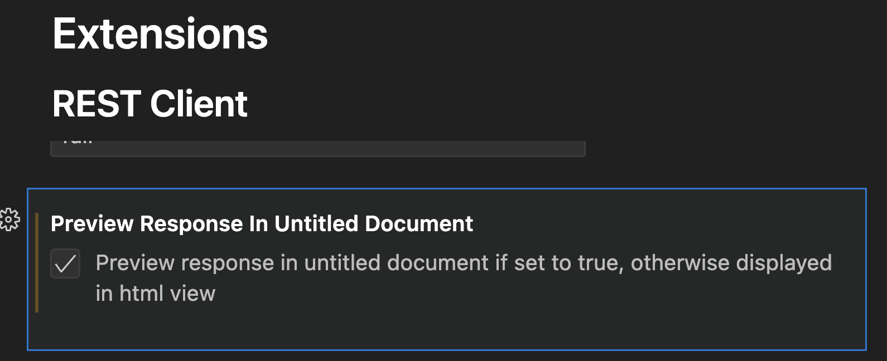
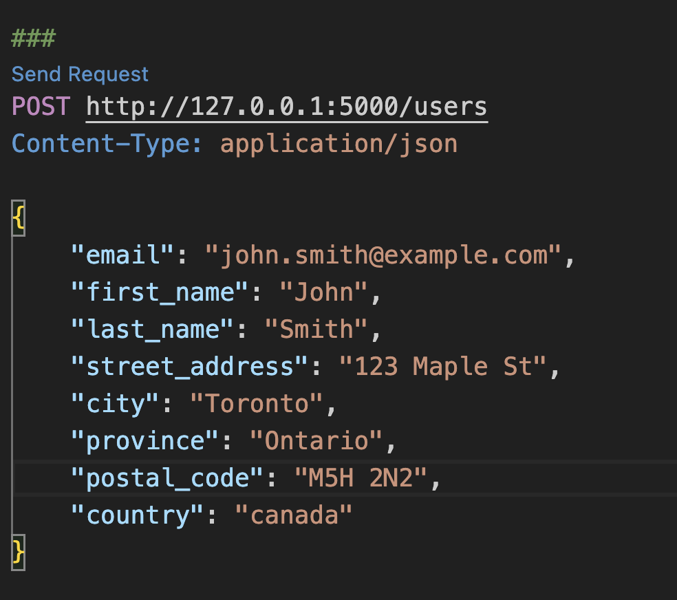
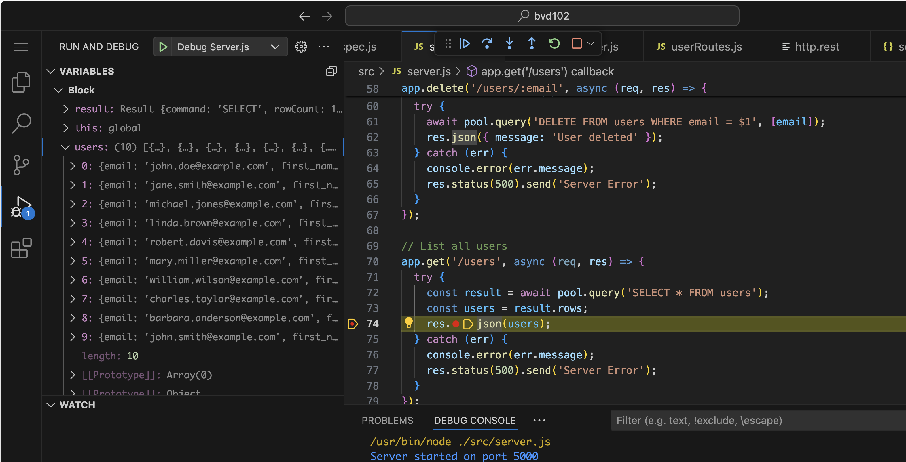
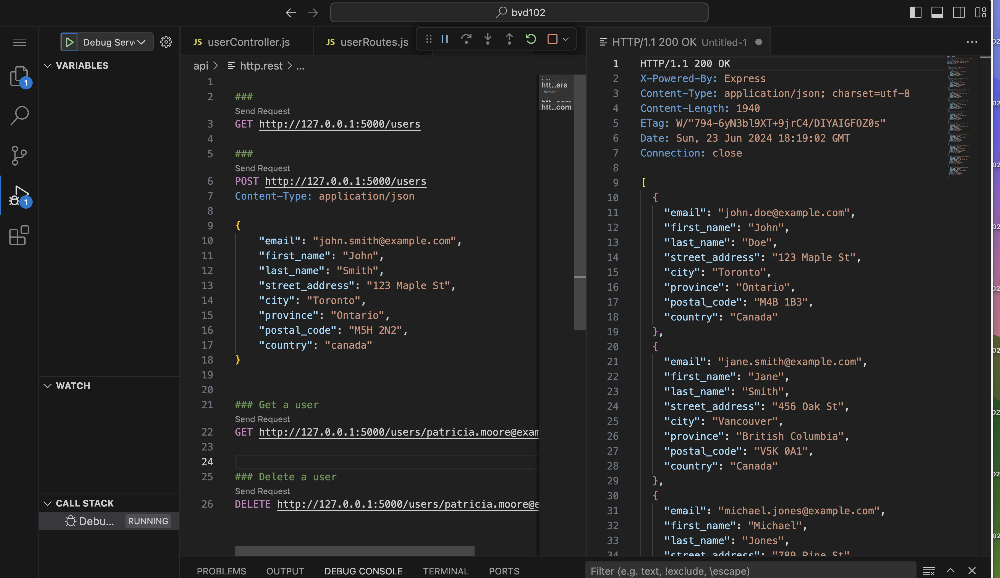

# BDV 102: Zoom Coding Workshop

# Create Project In Neon Postgres Databases

https://console.neon.tech/

## Create Table in SQL Editor
```sql
CREATE TABLE users (
    email VARCHAR(255) PRIMARY KEY,
    first_name VARCHAR(100) NOT NULL,
    last_name VARCHAR(100) NOT NULL,
    street_address VARCHAR(255) NOT NULL,
    city VARCHAR(100) NOT NULL,
    province VARCHAR(100) NOT NULL,
    postal_code VARCHAR(20) NOT NULL,
    country VARCHAR(100) DEFAULT 'Canada' NOT NULL
);```


## Add 10 users
```sql
INSERT INTO users (email, first_name, last_name, street_address, city, province, postal_code, country) VALUES
('john.doe@example.com', 'John', 'Doe', '123 Maple St', 'Toronto', 'Ontario', 'M4B 1B3', 'Canada'),
('jane.smith@example.com', 'Jane', 'Smith', '456 Oak St', 'Vancouver', 'British Columbia', 'V5K 0A1', 'Canada'),
('michael.jones@example.com', 'Michael', 'Jones', '789 Pine St', 'Montreal', 'Quebec', 'H1A 0A1', 'Canada'),
('linda.brown@example.com', 'Linda', 'Brown', '101 Birch St', 'Calgary', 'Alberta', 'T2P 1J9', 'Canada'),
('robert.davis@example.com', 'Robert', 'Davis', '202 Cedar St', 'Ottawa', 'Ontario', 'K1A 0A1', 'Canada'),
('mary.miller@example.com', 'Mary', 'Miller', '303 Spruce St', 'Edmonton', 'Alberta', 'T5J 0A1', 'Canada'),
('william.wilson@example.com', 'William', 'Wilson', '404 Elm St', 'Winnipeg', 'Manitoba', 'R3C 0A1', 'Canada'),
('patricia.moore@example.com', 'Patricia', 'Moore', '505 Fir St', 'Halifax', 'Nova Scotia', 'B3H 0A1', 'Canada'),
('charles.taylor@example.com', 'Charles', 'Taylor', '606 Ash St', 'Victoria', 'British Columbia', 'V8W 0A1', 'Canada'),
('barbara.anderson@example.com', 'Barbara', 'Anderson', '707 Willow St', 'Quebec City', 'Quebec', 'G1A 0A1', 'Canada');
```

## Find the database connection configuration from the dashboard tab and node.js details

Example:
```
PGHOST='ep-blue-meadow-a5114lzx.us-east-2.aws.neon.tech'
PGDATABASE='ass4'
PGUSER='per.pettersson'
PGPASSWORD='ULxxxx'
ENDPOINT_ID='ep-blue-meadow-a5114lzx'
```

# Setting up a node project in VSCode

## Initialize the Project

	1.	Open VS Code and create a new directory for your project.
	2.	Open the terminal in VS Code and run the following command to initialize a new Node.js project:

```
npm init -y
```

This will create a package.json file with default settings.

## Install Required Libraries to handle http and database connections

Install Express, dotenv, and pg (PostgreSQL client for Node.js):

```
npm install express dotenv pg
```

## Install Jest for testing:
```
npm install --save-dev jest
```

## Set Up Configuration

Create a file named "config.env" in the root directory of your project to store your configuration variables for the neon database:

Example:
```
PGHOST='ep-blue-meadow-a5114lzx.us-east-2.aws.neon.tech'
PGDATABASE='ass4'
PGUSER='per.pettersson'
PGPASSWORD='ULxxxx'
ENDPOINT_ID='ep-blue-meadow-a5114lzx'
```


#### Create a Database Connection Module to your Neon Database

Create file <project-root>/src/db.js with the following content

```
const { config } = require('dotenv');
const path = require('path');
const { Pool } = require('pg');
require('dotenv').config({ path: 'config.env' });


const { PGHOST, PGDATABASE, PGUSER, PGPASSWORD, DATABASE_USE_SSL } = process.env;

const poolConfig = {
    host: PGHOST,
    database: PGDATABASE,
    user: PGUSER,
    password: PGPASSWORD,
    ssl: {
        require: true,
        rejectUnauthorized: false,
    },
};

const pool = new Pool(poolConfig);

module.exports = {
    query: (text, params) => pool.query(text, params),
    connect: () => pool.connect(),
    end: () => pool.end(),
};
```


## Configure Jest

In your package.json, add a script to run Jest tests:
```
{
  "scripts": {
    "test": "jest"
  }
}
```

## Create Project Structure

```
<root>
     /src/
         /controllers/
         /routes/
         /test/ 
```


## Create a Jest Test case

Create file <project-root>/src/test/db.spec.test.js with this content
```
const pool = require('../db');

describe('Test Database Operations', () => {
	test('List all users in the user table', async () => {
		const result = await pool.query('SELECT * FROM users');
		result.rows.forEach(row => {
			console.log(row);
		});
	});
});

```

## Run the tests to verify connection to the Database

```
npm run test
```

you should expect to see the 10 users printed out at successful completion.

```
root@cc0fccc9d59e:~/bvd102# npm run test

> bvd102@1.0.0 test
> jest

  console.log
    {
      email: 'john.doe@example.com',
      first_name: 'John',
      last_name: 'Doe',
      street_address: '123 Maple St',
      city: 'Toronto',
      province: 'Ontario',
      postal_code: 'M4B 1B3',
      country: 'Canada'
    }

      at log (src/test/db.spec.js:7:12)
          at Array.forEach (<anonymous>)

  console.log
    {
      email: 'jane.smith@example.com',
      first_name: 'Jane',
      last_name: 'Smith',
      street_address: '456 Oak St',
      city: 'Vancouver',
      province: 'British Columbia',
      postal_code: 'V5K 0A1',
      country: 'Canada'
    }

      at log (src/test/db.spec.js:7:12)
          at Array.forEach (<anonymous>)

  console.log
    {
      email: 'michael.jones@example.com',
      first_name: 'Michael',
      last_name: 'Jones',
      street_address: '789 Pine St',
      city: 'Montreal',
      province: 'Quebec',
      postal_code: 'H1A 0A1',
      country: 'Canada'
    }

      at log (src/test/db.spec.js:7:12)
          at Array.forEach (<anonymous>)

  console.log
    {
      email: 'linda.brown@example.com',
      first_name: 'Linda',
      last_name: 'Brown',
      street_address: '101 Birch St',
      city: 'Calgary',
      province: 'Alberta',
      postal_code: 'T2P 1J9',
      country: 'Canada'
    }

      at log (src/test/db.spec.js:7:12)
          at Array.forEach (<anonymous>)

  console.log
    {
      email: 'robert.davis@example.com',
      first_name: 'Robert',
      last_name: 'Davis',
      street_address: '202 Cedar St',
      city: 'Ottawa',
      province: 'Ontario',
      postal_code: 'K1A 0A1',
      country: 'Canada'
    }

      at log (src/test/db.spec.js:7:12)
          at Array.forEach (<anonymous>)

  console.log
    {
      email: 'mary.miller@example.com',
      first_name: 'Mary',
      last_name: 'Miller',
      street_address: '303 Spruce St',
      city: 'Edmonton',
      province: 'Alberta',
      postal_code: 'T5J 0A1',
      country: 'Canada'
    }

      at log (src/test/db.spec.js:7:12)
          at Array.forEach (<anonymous>)

  console.log
    {
      email: 'william.wilson@example.com',
      first_name: 'William',
      last_name: 'Wilson',
      street_address: '404 Elm St',
      city: 'Winnipeg',
      province: 'Manitoba',
      postal_code: 'R3C 0A1',
      country: 'Canada'
    }

      at log (src/test/db.spec.js:7:12)
          at Array.forEach (<anonymous>)

  console.log
    {
      email: 'charles.taylor@example.com',
      first_name: 'Charles',
      last_name: 'Taylor',
      street_address: '606 Ash St',
      city: 'Victoria',
      province: 'British Columbia',
      postal_code: 'V8W 0A1',
      country: 'Canada'
    }

      at log (src/test/db.spec.js:7:12)
          at Array.forEach (<anonymous>)

  console.log
    {
      email: 'barbara.anderson@example.com',
      first_name: 'Barbara',
      last_name: 'Anderson',
      street_address: '707 Willow St',
      city: 'Quebec City',
      province: 'Quebec',
      postal_code: 'G1A 0A1',
      country: 'Canada'
    }

      at log (src/test/db.spec.js:7:12)
          at Array.forEach (<anonymous>)

  console.log
    {
      email: 'john.smith@example.com',
      first_name: 'John',
      last_name: 'Smith',
      street_address: '123 Maple St',
      city: 'Toronto',
      province: 'Ontario',
      postal_code: 'M5H 2N2',
      country: 'canada'
    }

      at log (src/test/db.spec.js:7:12)
          at Array.forEach (<anonymous>)

 PASS  src/test/db.spec.js
  Database Operations
    ✓ Get all users (654 ms)

Test Suites: 1 passed, 1 total
Tests:       1 passed, 1 total
Snapshots:   0 total
Time:        1.048 s, estimated 2 s
Ran all test suites.
```

## Create main Application for http and sql

Create the file <project-root>/src/server.js with the following content"

```
const express = require('express');
const pool = require('./db.js')
const app = express();
app.use(express.json());


const express = require('express');
const userRoutes = require('./routes/userRoutes');

const pool = require('./db.js')

const app = express();
app.use(express.json());

// Use routes
app.use('/', userRoutes);


// Routes
// Create a new user
app.post('/users', async (req, res) => {
  const { email, first_name, last_name, street_address, city, province, postal_code, country } = req.body;
  try {
    const newUser = await pool.query(
      'INSERT INTO users (email, first_name, last_name, street_address, city, province, postal_code, country) VALUES ($1, $2, $3, $4, $5, $6, $7, $8) RETURNING *',
      [email, first_name, last_name, street_address, city, province, postal_code, country]
    );
    res.json(newUser.rows[0]);
  } catch (err) {
    console.error(err.message);
    res.status(500).send('Server Error');
  }
});

// Get a user by email
app.get('/users/:email', async (req, res) => {
  const { email } = req.params;
  try {
    const user = await pool.query('SELECT * FROM users WHERE email = $1', [email]);
    res.json(user.rows[0]);
  } catch (err) {
    console.error(err.message);
    res.status(500).send('Server Error');
  }
});

// Update a user by email
app.put('/users/:email', async (req, res) => {
  const { email } = req.params;
  const { first_name, last_name, street_address, city, province, postal_code, country } = req.body;
  try {
    const updatedUser = await pool.query(
      'UPDATE users SET first_name = $1, last_name = $2, street_address = $3, city = $4, province = $5, postal_code = $6, country = $7 WHERE email = $8 RETURNING *',
      [first_name, last_name, street_address, city, province, postal_code, country, email]
    );
    res.json(updatedUser.rows[0]);
  } catch (err) {
    console.error(err.message);
    res.status(500).send('Server Error');
  }
});

// Delete a user by email
app.delete('/users/:email', async (req, res) => {
  const { email } = req.params;
  try {
    await pool.query('DELETE FROM users WHERE email = $1', [email]);
    res.json({ message: 'User deleted' });
  } catch (err) {
    console.error(err.message);
    res.status(500).send('Server Error');
  }
});

// List all users
app.get('/users', async (req, res) => {
  try {
    const result = await pool.query('SELECT * FROM users');
    const users = result.rows;
    res.json(users);
  } catch (err) {
    console.error(err.message);
    res.status(500).send('Server Error');
  }
});
// Routes
// Create a new user
app.post('/users', async (req, res) => {
  const { email, first_name, last_name, street_address, city, province, postal_code, country } = req.body;
  try {
    const newUser = await pool.query(
      'INSERT INTO users (email, first_name, last_name, street_address, city, province, postal_code, country) VALUES ($1, $2, $3, $4, $5, $6, $7, $8) RETURNING *',
      [email, first_name, last_name, street_address, city, province, postal_code, country]
    );
    res.json(newUser.rows[0]);
  } catch (err) {
    console.error(err.message);
    res.status(500).send('Server Error');
  }
});

// // Get a user by email
app.get('/users/:email', async (req, res) => {
  const { email } = req.params;
  try {
    const user = await pool.query('SELECT * FROM users WHERE email = $1', [email]);
    res.json(user.rows[0]);
  } catch (err) {
    console.error(err.message);
    res.status(500).send('Server Error');
  }
});

// Update a user by email
app.put('/users/:email', async (req, res) => {
  const { email } = req.params;
  const { first_name, last_name, street_address, city, province, postal_code, country } = req.body;
  try {
    const updatedUser = await pool.query(
      'UPDATE users SET first_name = $1, last_name = $2, street_address = $3, city = $4, province = $5, postal_code = $6, country = $7 WHERE email = $8 RETURNING *',
      [first_name, last_name, street_address, city, province, postal_code, country, email]
    );
    res.json(updatedUser.rows[0]);
  } catch (err) {
    console.error(err.message);
    res.status(500).send('Server Error');
  }
});

// Delete a user by email
app.delete('/users/:email', async (req, res) => {
  const { email } = req.params;
  try {
    await pool.query('DELETE FROM users WHERE email = $1', [email]);
    res.json({ message: 'User deleted' });
  } catch (err) {
    console.error(err.message);
    res.status(500).send('Server Error');
  }
});

// // List all users
app.get('/users', async (req, res) => {
  try {
    const result = await pool.query('SELECT * FROM users');
    const users = result.rows;
    res.json(users);
  } catch (err) {
    console.error(err.message);
    res.status(500).send('Server Error');
  }
});

const PORT = process.env.PORT || 5000;
app.listen(PORT, () => console.log(`Server started on port ${PORT}`));

```


## Run the server

To run the server issue the followinf command in a terminal.
```
node src/server.js
```
Press <crl-c> to stop the server.

## Install the VSCode Rest client
Locate the extension in the VSCode and search for rest client and install the extension.
https://marketplace.visualstudio.com/items?itemName=humao.rest-client

We had issues seeing responses in the rest client. To fix this we had to enable the setting "Preview in Untitled Document"




## Create Http Samples for Rest client

Create a directory api and a file "user.rest" with following content.

```
###
GET http://127.0.0.1:5000/users

###
POST http://127.0.0.1:5000/users
Content-Type: application/json

{
    "email": "john.smith@example.com",
    "first_name": "John",
    "last_name": "Smith",
    "street_address": "123 Maple St",
    "city": "Toronto",
    "province": "Ontario",
    "postal_code": "M5H 2N2",
    "country": "canada"
}


### Get a user
GET http://127.0.0.1:5000/users/patricia.moore@example.com


### Delete a user
DELETE http://127.0.0.1:5000/users/patricia.moore@example.com
```

The Rest Client extension recognizes a file with the extension `.rest` and creates 'clickable' links for each HTTP request.




## Debug the server in VScode
Create a directory ".vscode" and tdd the file "launch.json" with the following content.
```
{
  "version": "0.2.0",
  "configurations": [
    {
      "name": "Debug Server.js",
      "program": "${workspaceFolder}/src/server.js",
      "request": "launch",
      "skipFiles": [
        "<node_internals>/**"
      ],
      "type": "node"
    },
    {
      "type": "node",
      "request": "launch",
      "name": "Debug Jest Tests",
      "program": "${workspaceFolder}/node_modules/.bin/jest",
      "args": [
        "--runInBand"
      ],
      "console": "integratedTerminal",
      "internalConsoleOptions": "neverOpen",
      "windows": {
        "program": "${workspaceFolder}/node_modules/jest/bin/jest.js"
      }
    }
  ]
}
``` 


## VScode Debug 
With the debug configuration in place, you can select the debug view in the left hand pane and select "Debug Server.js" to start the server. Click on the code to set breakpoints.



## Sending Http Request with Rest Client
You can now send the Http requests in the rest client and see the response. The request is handled by your server and data is fetched from the database.



# Refactor application in routes and controllers
The initial server includes logic to handle http API and interaction with the database in one single file "server.js". This is not a good practice. We will refactor the application to separate the logic into two files.

## Create controllers

1. Create a directory "src/controllers" with the following file "userController.js" and content.
```
const pool = require('../db.js');


// Create a new user
exports.createUser = async (req, res) => {
  const { email, first_name, last_name, street_address, city, province, postal_code, country } = req.body;
  try {
    const newUser = await pool.query(
      'INSERT INTO users (email, first_name, last_name, street_address, city, province, postal_code, country) VALUES ($1, $2, $3, $4, $5, $6, $7, $8) RETURNING *',
      [email, first_name, last_name, street_address, city, province, postal_code, country]
    );
    res.json(newUser.rows[0]);
  } catch (err) {
    console.error(err.message);
    res.status(500).send('Server Error');
  }
};

// Get a user by email
exports.getUserByEmail = async (req, res) => {
  const { email } = req.params;
  try {
    const user = await pool.query('SELECT * FROM users WHERE email = $1', [email]);
    res.json(user.rows[0]);
  } catch (err) {
    console.error(err.message);
    res.status(500).send('Server Error');
  }
};

// Update a user by email
exports.updateUserByEmail = async (req, res) => {
  const { email } = req.params;
  const { first_name, last_name, street_address, city, province, postal_code, country } = req.body;
  try {
    const updatedUser = await pool.query(
      'UPDATE users SET first_name = $1, last_name = $2, street_address = $3, city = $4, province = $5, postal_code = $6, country = $7 WHERE email = $8 RETURNING *',
      [first_name, last_name, street_address, city, province, postal_code, country, email]
    );
    res.json(updatedUser.rows[0]);
  } catch (err) {
    console.error(err.message);
    res.status(500).send('Server Error');
  }
};

// Delete a user by email
exports.deleteUserByEmail = async (req, res) => {
  const { email } = req.params;
  try {
    await pool.query('DELETE FROM users WHERE email = $1', [email]);
    res.json({ message: 'User deleted' });
  } catch (err) {
    console.error(err.message);
    res.status(500).send('Server Error');
  }
};

// List all users
exports.listUsers = async (req, res) => {
  try {
    const result = await pool.query('SELECT * FROM users');
    const users = result.rows;
    res.json(users);
  } catch (err) {
    console.error(err.message);
    res.status(500).send('Server Error');
  }
};
```

## Create Routes
1. Create a directory "src/routes" with the following file "userRoutes.js" and content.

```
const express = require('express');
const router = express.Router();
const {
  createUser,
  getUserByEmail,
  updateUserByEmail,
  deleteUserByEmail,
  listUsers
} = require('../controllers/userController');

router.post('/users', createUser);
router.get('/users/:email', getUserByEmail);
router.put('/users/:email', updateUserByEmail);
router.delete('/users/:email', deleteUserByEmail);
router.get('/users', listUsers);

module.exports = router;
```


## Update server.js to use the userRoutes

The server.js can be updated to use the userRoutes module. With this refactor the server.js file will be cleaner and easier to maintain.

```
const express = require('express');
const userRoutes = require('./routes/userRoutes');
const pool = require('./db.js')

const app = express();
app.use(express.json());

// Configure user routes
app.use('/', userRoutes);

const PORT = process.env.PORT || 5000;
app.listen(PORT, () => console.log(`Server started on port ${PORT}`));

```