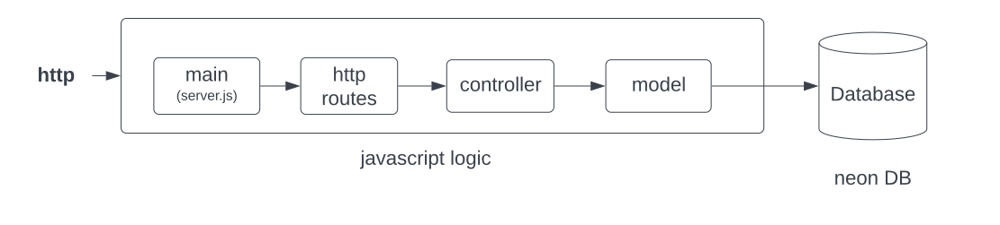

# Module 7: Web API Development for Online Store

In this module, we will continue the backend development using JavaScript and SQL for our hypothetical online store with the Schema as introduced in module 6. 


This module aims to solidify your understanding of backend server frameworks using Node.js, enhancing your skills in:

- Utilizing JavaScript libraries and frameworks for robust backend development    
- Implementing HTTP REST endpoints for managing customers and products   
- Developing backend logic to efficiently handle HTTP requests and manage database persistence   
- Mastering both raw SQL and Sequelize ORM for effective database interactions   
- Employing API testing tools to validate HTTP REST requests   

---

### Next Steps in the Learning Journey

After solidifying the foundation in in this, you will progress to implementing the shopping cart and order functionalities in the backend as part of a capstone project during Modules 8 and 9. This will include:

- Defining HTTP requests with JSON payloads for testing with a REST client.
- Developing HTTP REST endpoints for carts and cart items.
- Routing HTTP requests and managing data persistence in the backend.
- Integrating raw SQL and Sequelize ORM for database operations from JavaScript.

## Recommended Readings

- For an in-depth understanding of Sequelize, refer to the [Sequelize Documentation](https://sequelize.org/docs/v6/getting-started/).
- To learn more about REST, visit [What is REST](https://restfulapi.net).

---

### Learning Activities
Building on the foundations laid in this module, you will transition to advanced backend functionalities in Modules 8 and 9, focusing on shopping cart and order processing. This progression includes:

- Crafting and testing HTTP requests with JSON payloads using REST clients.
- Establishing robust HTTP REST endpoints for carts and cart items.
- Refining backend routing and data persistence mechanisms.
- Integrating advanced database operations using raw SQL and Sequelize ORM.

### Tasks

### Project Setup and Understanding
Database Connectivity Verification:
Confirm the established database connection from Module 6, ensuring seamless API development integration.

- Request Flow Comprehension:
   
- Analyze the request flow diagram to understand backend request processing fully, highlighting the journey from entry points to database interactions.

- Development and Implementation
Express Server Configuration:
Examine and configure the Express server setup in src/server.js, understanding the orchestration of HTTP request handling and route registration.

- RESTful Routing and Logic Development:
Review and develop RESTful routes, ensuring a thorough understanding of HTTP methods integration and backend logic encapsulation in src/routes and src/controllers.

- API Endpoint Definition:
Utilize the existing SQL schema to define and implement HTTP API endpoints, facilitating effective CRUD operations.

### Tasks Checklist:
- [ ] Set up the Neon project and configure the database as outlined.
- [ ] Update the database connection settings in JavaScript.
- [ ] Review the request flow and examine the source code of routers, controllers, and models.
- [ ] Run manual tests with the REST client to send REST request and trigget, deletion, and data population.

```
├── package.json
├── src
│   ├── api
│   ├── config
│   │   └── config.env
│   ├── controllers
│   │   ├── raw_sql
│   │   └── orm
│   ├── models
│   ├── routes
│   ├── server.js
│   └── sql
└── test
    └── database.test.js
```